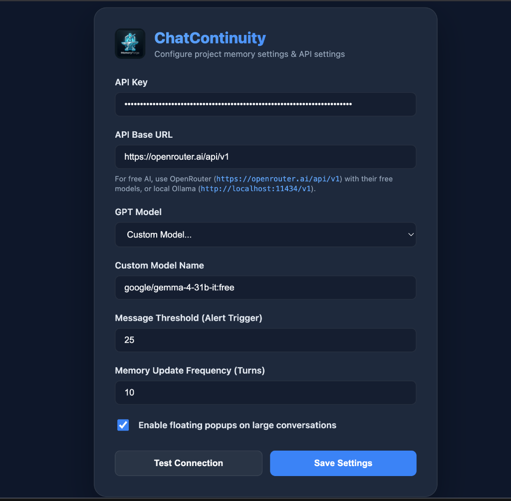
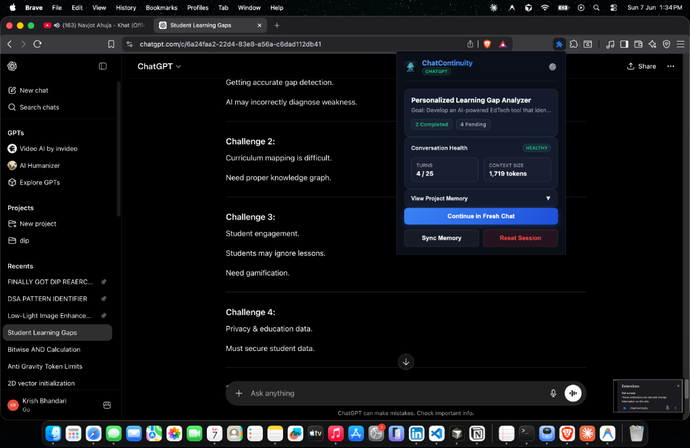

# ChatContinuity

Have you ever noticed that the longer you chat with ChatGPT or Claude, the slower and dumber they get? 

As your conversation grows, the browser tab starts lagging, the AI begins forgetting the instructions you gave it at the start, and eventually, you hit those annoying rate limits or message caps.

When this happens, you have to manually copy-paste your code, summarize what you've done so far, and start a brand-new chat. It's a huge waste of time.

**ChatContinuity** solves this. It is a simple Chrome extension that runs in the background while you work. It keeps track of your project's main goals, completed tasks, pending work, and key decisions. When your chat gets too long, it warns you and lets you jump to a fresh, clean chat with a single click—automatically carrying over all your context so you can keep working without missing a beat.

---

## Why use ChatContinuity?

* **No more laggy tabs:** AI chats get heavy and slow down your browser. ChatContinuity lets you reset the chat frequently so the page stays fast.
* **No lost instructions:** The AI will never "forget" your rules or project constraints. The extension summarizes your project state using AI and pastes it into the new chat.
* **Saves your API limits & message caps:** Clean chats consume far fewer tokens, saving your limits.

---

## How to Install (Step-by-Step)

Since this is a custom extension (not on the Chrome Web Store yet), you can install it manually in less than a minute:

1. **Download the project folder** to your computer.
2. Open your browser (Chrome, Brave, Edge, etc.) and go to the Extensions page:
   * Type `chrome://extensions/` in your URL bar and press Enter.
3. Turn on **Developer mode** (it's a toggle switch in the top-right corner of the page).
4. Click the **Load unpacked** button in the top-left corner.
5. Select the `ChatContinuity` folder you just downloaded.
6. **Pin the extension:** Click the extension puzzle piece icon in your browser toolbar, find **ChatContinuity**, and click the Pin icon so it is visible in your toolbar.
   
   

7. Click the extension icon, open its **Options** (settings) page.
8. Paste your API key (you can use your OpenAI API key, Gemini API key, or OpenRouter key), choose your model, and click **Save Settings**. (You can click **Test Connection** to make sure it works!).

   

---

## How to Use It

1. Open **ChatGPT** or **Claude** and start working on your project as usual.
2. As you chat, the extension keeps track of the conversation size in the background. You can click the extension icon anytime to see your active project goal, completed tasks, and current status.

   

3. When the chat starts getting too long, a small warning box will slide in at the bottom-right corner of your screen.
4. Click **"Continue in Fresh Chat"**.
5. The extension will automatically open a new chat page, summarize everything you've done so far, paste the summary into the text box, and focus your cursor. 
6. Just hit Send, and keep coding!

---

## Common Mistakes Users Make (And How to Avoid Them)

### 1. Forgetting to refresh the page after installing or updating
* **The Mistake:** You install or update the extension, go to your open Claude or ChatGPT tab, click the extension icon, and it says "No active conversation tracked" or doesn't work.
* **The Fix:** Whenever you install or update *any* Chrome extension, **you must reload/refresh your active tabs** (`⌘ + R` or `Ctrl + R`) for the new scripts to inject into the page.

### 2. Typing before the auto-paste finishes
* **The Mistake:** When you jump to a new chat, you start typing immediately, which interferes with the extension trying to auto-paste the summary.
* **The Fix:** Wait 1 second when the new chat opens. Let the extension paste the green success toast and populate the text box, then hit Send.

### 3. Using an invalid API Key or wrong API URL
* **The Mistake:** Getting connection failures because the API configuration is incorrect.
* **The Fix:** If you are using Google AI Studio (Gemini) or OpenRouter, make sure you set the correct **API Base URL** and select a model name that matches exactly. Use the **Test Connection** button on the settings page to verify it before you start chatting.

### 4. Brave Browser shields blocking the connection
* **The Mistake:** If you use Brave, its built-in shields might sometimes block local API requests (like Ollama running on localhost).
* **The Fix:** If you run into connection blocks, check Brave Shields (the lion icon in the URL bar) and allow connections, or use a cloud API key like Gemini or OpenRouter.

---

## How It Works (For Developers)

The extension uses a MutationObserver to listen to new messages on the screen. It extracts the raw chat text using stable CSS selectors (`data-testid="user-message"`, `#prompt-textarea`, etc.). It then periodically sends context snippets to your configured LLM API to update a structured JSON schema of your project's memory. When you redirect, it compiles this JSON into a neat prompt template and uses simulated paste events to input it into the new tab.
